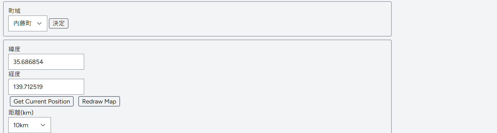
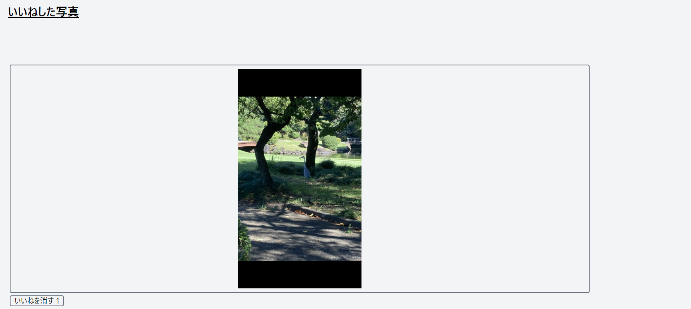

# photo-walk

## 概要
散歩中などに撮影した写真を匿名で投稿するアプリです。検索、投稿、いいね、撮影、位置情報取得などの機能があります。

## 機能
### 投稿
写真を投稿する場合、写真に複数の情報を付けて投稿します。追加情報には、用意されているものから選択する基本タグ、自由につける記述することができるカスタムタグ、位置情報の３つがあります。
これらの情報は写真の概要を説明し検索する際に用います。また、座標取得には現在地取得と、「HeartRails Geo API」を利用した地名から座標を取得する２通りの方法があります。

### 検索
写真を検索する為には、基本タグ、カスタムタグ、位置情報の３つの情報を使います。
基本タグ、カスタムタグを指定した場合指定したタグと一致するタグを持つ写真が検索されます。位置情報を用いて検索する場合には、位置情報とその座標からの距離を記入し、位置情報から指定した距離より近い位置で撮影された写真が検索されます。

### いいね
投稿された写真に対していいねすることができます。また、いいねした写真を取得する機能も存在しています。

